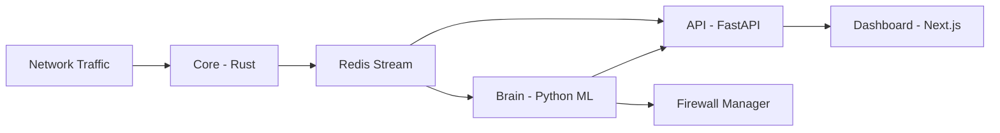

# Revenix - AI-Powered Network Security Platform

> **Intelligent threat detection and autonomous response for modern networks**


## Overview

Revenix is an advanced Network Intrusion Detection and Prevention System (NIDPS) that combines **Deep Packet Inspection** with **5-model Machine Learning ensemble** to automatically detect and respond to cyber threats. Built for the **NOIT Bulgaria 2026** competition.

### Key Features

- ** Deep Packet Inspection (DPI)**
  - JA3/JA3S TLS fingerprinting for malware detection
  - DNS tunneling detection via entropy analysis
  - SSH brute-force attempt tracking
  - Protocol anomaly detection

- ** 5-Model ML Ensemble**
  - Isolation Forest (outlier detection)
  - Autoencoder (reconstruction-based anomaly)
  - LSTM Sequential Detector (time-series patterns)
  - Baseline Deviation Analyzer
  - Per-Device Behavioral Profiling

- ** Autonomous Response (Self-Healing)**
  - Automatic threat blocking (configurable)
  - Smart whitelisting of benign traffic
  - Temporary vs. permanent firewall rules
  - Rule recommendation system

- ** Real-Time Dashboard**
  - Live traffic visualization
  - WebSocket-powered updates
  - Interactive threat map (geolocation)
  - Alert management and acknowledgement
  - System health monitoring

##  Architecture



### Components

| Component | Technology | Purpose |
|-----------|-----------|---------|
| **Core** | Rust + libpcap | Packet capture, flow aggregation, DPI |
| **Brain** | Python + scikit-learn/TensorFlow | ML-based threat detection |
| **API** | FastAPI + PostgreSQL | Data persistence, authentication, WebSocket |
| **Dashboard** | Next.js 16 + Tailwind CSS | Real-time monitoring UI |
| **Redis** | Redis Streams | High-performance message broker |

##  Quick Start

### Prerequisites

- Docker & Docker Compose
- Linux OS (for packet capture - requires `NET_ADMIN` capability) or Windows 0S
- At least 4GB RAM recommended for the host PC

### Windows Agent Deployment

For enterprise Windows endpoints, deploy a native `core` agent instead of Docker Desktop packet capture.

1. Build Windows bundle from `core`:
   ```powershell
   cd core
   .\scripts\build-windows-agent.ps1
   ```
2. Copy `core\dist\windows-agent` to the Windows endpoint.
3. Copy `agent.env.example` to `agent.env` and set `API_URL` / `REDIS_URL`.
4. (Optional, recommended) place Npcap installer at `dependencies\npcap-installer.exe`.
5. (Optional) place VC++ runtime installer at `dependencies\vc_redist.x64.exe`.
6. Install as Administrator:
   ```powershell
   Set-ExecutionPolicy -Scope Process Bypass -Force
   .\install.cmd
   ```
7. Details, manual install, and uninstall steps are in `agents/windows/README.md`.

### Installation

1. **Clone the repository**
   ```bash
   git clone https://github.com/so1icitx/Revenix.git
   cd Revenix
   ```

2. **Start all services**
   ```bash
   # linux
   docker-compose up --build

   # windows
   python3 start-revenix.py 
   ```
   
3. **Access the dashboard**
   - Open browser: http://localhost:3000
   - Default credentials: _Set up on first run_


##  Troubleshooting

### Common Issues

**"Permission denied" on packet capture**:
```bash
# Ensure Core container has NET_ADMIN capability
# Check docker-compose.yml has:
cap_add:
  - NET_ADMIN
```

**Models not training**:
- Check logs: `docker-compose logs brain`
- Verify flows are being captured: `docker-compose logs core`
- Ensure learning threshold met (default 200 flows)

**Dashboard not loading**:
```bash
# Check API is running
curl http://localhost:8000/health

# Verify database migration
docker-compose exec api python -c "from db import engine; print('DB OK')"
```

### Debug Mode

Enable verbose logging:
```bash
# docker-compose.yml
environment:
  - LOG_LEVEL=DEBUG
```


##  Security Considerations

### Production Deployment

 **This is a research/competition project. For production use**:

1. **Change default credentials** in all services
2. **Use strong SECRET_KEY** for JWT signing
3. **Enable HTTPS** (add reverse proxy like nginx)
4. **Restrict API access** (firewall rules, IP whitelisting)
5. **Review auto-block settings** (test in monitor-only mode first)
6. **Regular backups** of database and model files
7. **Monitor system logs** for anomalies

### Known Limitations

- Currently monitors single interface (multi-interface requires multiple Core instances)
- JA3 database needs periodic updates for new malware families
- High traffic (>10k pps) may require hardware acceleration
- No built-in email/SMS alerting (webhook integration available)

## License

This project is licensed under the GNU General Public License v3.0 - see [LICENSE](LICENSE) file for details.


##  Acknowledgments

- JA3 Malware Database: [Abuse.ch SSL Blacklist](https://sslbl.abuse.ch/)
- ML Techniques: Inspired by Darktrace, Vectra AI
- Icons: [Lucide React](https://lucide.dev/)
- UI Components: [shadcn/ui](https://ui.shadcn.com/)

---

** If you find this project useful, please star the repository!**

For questions or support: [Open an issue](https://github.com/so1icitx/Revenix/issues)
