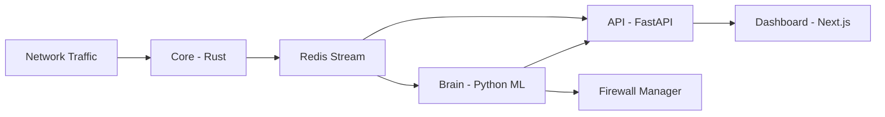

# 🛡️ Revenix - AI-Powered Network Security Platform

> **Intelligent threat detection and autonomous response for modern networks**


## 🎯 Overview

Revenix is an advanced Network Intrusion Detection and Prevention System (NIDPS) that combines **Deep Packet Inspection** with **5-model Machine Learning ensemble** to automatically detect and respond to cyber threats. Built for the **NOIT Bulgaria 2026** competition.

### Key Features

- **🔍 Deep Packet Inspection (DPI)**
  - JA3/JA3S TLS fingerprinting for malware detection
  - DNS tunneling detection via entropy analysis
  - SSH brute-force attempt tracking
  - Protocol anomaly detection

- **🤖 5-Model ML Ensemble**
  - Isolation Forest (outlier detection)
  - Autoencoder (reconstruction-based anomaly)
  - LSTM Sequential Detector (time-series patterns)
  - Baseline Deviation Analyzer
  - Per-Device Behavioral Profiling

- **🛡️ Autonomous Response (Self-Healing)**
  - Automatic threat blocking (configurable)
  - Smart whitelisting of benign traffic
  - Temporary vs. permanent firewall rules
  - Rule recommendation system

- **📊 Real-Time Dashboard**
  - Live traffic visualization
  - WebSocket-powered updates
  - Interactive threat map (geolocation)
  - Alert management and acknowledgement
  - System health monitoring

## 🏗️ Architecture



### Components

| Component | Technology | Purpose |
|-----------|-----------|---------|
| **Core** | Rust + libpcap | Packet capture, flow aggregation, DPI |
| **Brain** | Python + scikit-learn/TensorFlow | ML-based threat detection |
| **API** | FastAPI + PostgreSQL | Data persistence, authentication, WebSocket |
| **Dashboard** | Next.js 16 + Tailwind CSS | Real-time monitoring UI |
| **Redis** | Redis Streams | High-performance message broker |

## 🚀 Quick Start

### Prerequisites

- Docker & Docker Compose
- Linux OS (for packet capture - requires `NET_ADMIN` capability)
- At least 4GB RAM recommended

### Windows Agent Deployment

For enterprise Windows endpoints, deploy a native `core` agent instead of Docker Desktop packet capture.

1. Build Windows bundle from `core`:
   ```powershell
   cd core
   .\scripts\build-windows-agent.ps1
   ```
2. Copy `core\dist\windows-agent` to the Windows endpoint.
3. Copy `agent.env.example` to `agent.env` and set `API_URL` / `REDIS_URL`.
4. (Optional, recommended) place Npcap installer at `dependencies\npcap-installer.exe`.
5. (Optional) place VC++ runtime installer at `dependencies\vc_redist.x64.exe`.
6. Install as Administrator:
   ```powershell
   Set-ExecutionPolicy -Scope Process Bypass -Force
   .\install.cmd
   ```
7. Details, manual install, and uninstall steps are in `agents/windows/README.md`.

### Installation

1. **Clone the repository**
   ```bash
   git clone https://github.com/yourusername/revenix.git
   cd revenix
   ```

2. **Start all services**
   ```bash
   docker-compose up --build
   ```

3. **Access the dashboard**
   - Open browser: http://localhost:3000
   - Default credentials: _Set up on first run_

### Initial Setup

1. **Learning Phase** (Recommended: 24-48 hours)
   - System collects baseline traffic patterns
   - Trains ML models on YOUR network behavior
   - Dashboard shows "Learning Mode" indicator

2. **Activate Protection**
   - Navigate to Settings → Switch to "Active Mode"
   - System now automatically detects and blocks threats

## 📖 Usage

### Monitoring Traffic

- **Live Traffic**: View real-time packet/flow data
- **Historical Flows**: Search and filter past network activity
- **Threats**: Review all detected alerts with severity levels

### Managing Threats

#### Auto-Block (Recommended)
```
Settings → Security → Enable Auto-Block
Threshold: 0.85 (default - higher = fewer false positives)
```

#### Manual Control
- **Whitelist IP**: IP Management → Add Trusted IP
- **Block IP**: IP Management → Add Blocked IP
- **Unblock**: Click "Unblock" next to temporary blocks

### Understanding Alerts

| Severity | Risk Score | Action |
|----------|-----------|--------|
| **Critical** | 0.90+ | Immediate investigation |
| **High** | 0.75-0.89 | Review within 1 hour |
| **Medium** | 0.60-0.74 | Monitor |
| **Low** | \< 0.60 | Informational |

## 🧠 ML Model Details

### Ensemble Voting

Revenix uses a **weighted ensemble** requiring **2+ models to agree** before raising an alert:

- **Isolation Forest** (35% weight): Detects outliers in feature space
- **Autoencoder** (40% weight): Flags high reconstruction errors
- **Baseline Deviation** (15% weight): Compares to learned baseline
- **Device Profile** (10% weight): Per-host behavioral analysis

### Training Strategy

1. **Initial Training**: After 200+ flows collected (configurable)
2. **Continuous Learning**: Retrains every 500 new flows or 7 days
3. **Safe Training**: Only uses verified benign traffic (>24hrs old w/ no alerts)

### Model Performance

_Based on testing with CICIDS2017 dataset:_
- **Precision**: 87.3%
- **Recall**: 82.1%
- **F1-Score**: 84.6%
- **False Positive Rate**: < 5% (with ensemble)

## 🔧 Configuration

### Environment Variables

Edit `docker-compose.yml` or create `.env`:

```env
# API Configuration
API_PORT=8000
DATABASE_URL=postgresql://revenix:secure_password@db:5432/revenix
SECRET_KEY=your-secret-key-here

# Core Configuration
CAPTURE_INTERFACE=eth0  # Change to your network interface
LEARNING_PHASE=true     # Start in learning mode

# Brain Configuration
ML_TRAINING_THRESHOLD=200
AUTO_BLOCK_ENABLED=true
ALERT_THRESHOLD=0.85
```

### Advanced Tuning

#### Sensitivity Adjustment

**Less sensitive** (fewer false positives):
```python
# brain/app/auto_learner.py
alert_threshold = 0.90
min_agreement = 3  # Require 3 models
```

**More sensitive** (catch more threats):
```python
alert_threshold = 0.75
min_agreement = 2
```

## 📊 Dashboard Features

### Pages Overview

- **Dashboard**: System overview, key metrics, recent alerts
- **Live Traffic**: Real-time packet/flow stream
- **Flows**: Historical flow analysis with filters
- **Threats**: Alert management and investigation
- **IP Management**: Whitelist/blacklist control
- **System Health**: Performance metrics, model status
- **Settings**: Configuration and training controls

### Keyboard Shortcuts

- `Ctrl + K`: Quick search
- `Ctrl + H`: Toggle sidebar
- `Esc`: Close modals

## 🧪 Testing

### Generate Test Traffic

**Port Scan Detection**:
```bash
nmap -p 1-1000 <target_ip>
# Should trigger "Port Scan" alert within seconds
```

**DNS Tunneling Simulation**:
```bash
dig verylongrandomstring123456789.example.com
# Triggers high-entropy domain detection
```

**Brute Force SSH**:
```bash
hydra -l admin -P passwords.txt ssh://<target_ip>
# Detected via failed attempt tracking
```

### Run Unit Tests

```bash
# Brain tests
docker-compose exec brain pip install -r requirements-test.txt
docker-compose exec brain pytest tests/ -v

# Dashboard tests (run from repository root)
cd dashboard && npm install && npm test
```

## 🐛 Troubleshooting

### Common Issues

**"Permission denied" on packet capture**:
```bash
# Ensure Core container has NET_ADMIN capability
# Check docker-compose.yml has:
cap_add:
  - NET_ADMIN
```

**Models not training**:
- Check logs: `docker-compose logs brain`
- Verify flows are being captured: `docker-compose logs core`
- Ensure learning threshold met (default 200 flows)

**Dashboard not loading**:
```bash
# Check API is running
curl http://localhost:8000/health

# Verify database migration
docker-compose exec api python -c "from db import engine; print('DB OK')"
```

### Debug Mode

Enable verbose logging:
```bash
# docker-compose.yml
environment:
  - LOG_LEVEL=DEBUG
```

## 🤝 API Endpoints

### Authentication

```bash
# Create first admin user (only available before initial setup is completed)
curl -X POST http://localhost:8000/auth/signup \
  -H "Content-Type: application/json" \
  -d '{"username":"admin", "email":"admin@revenix.io", "full_name":"Admin User", "password":"secure123"}'

# Login (get JWT)
curl -X POST http://localhost:8000/auth/login \
  -H "Content-Type: application/json" \
  -d '{"username":"admin", "password":"secure123"}'
```

### Flow Data

```bash
# Get recent flows
curl -H "Authorization: Bearer YOUR_JWT" \
  http://localhost:8000/flows?limit=100

# Get alerts
curl -H "Authorization: Bearer YOUR_JWT" \
  http://localhost:8000/alerts
```

### System Control

```bash
# Switch to active mode
curl -X PUT http://localhost:8000/system/learning-phase \
  -H "Authorization: Bearer YOUR_JWT" \
  -H "Content-Type: application/json" \
  -d '{"phase":"active"}'
```

Full API documentation: http://localhost:8000/docs (Swagger UI)

## 📁 Project Structure

```
revenix/
├── core/               # Rust packet capture & DPI
│   ├── src/
│   │   ├── main.rs
│   │   ├── dpi_analyzer.rs
│   │   └── flows.rs
│   └── Cargo.toml
├── brain/              # Python ML engine
│   ├── app/
│   │   ├── auto_learner.py
│   │   ├── ensemble_engine.py
│   │   ├── autoencoder_detector.py
│   │   └── ...
│   └── requirements.txt
├── api/                # FastAPI backend
│   ├── app/
│   │   ├── api.py
│   │   ├── auth.py
│   │   └── ...
│   └── requirements.txt
├── dashboard/          # Next.js frontend
│   ├── app/
│   ├── components/
│   └── package.json
├── deploy/
│   └── sql/            # Database migrations
└── docker-compose.yml
```

## 🔒 Security Considerations

### Production Deployment

⚠️ **This is a research/competition project. For production use**:

1. **Change default credentials** in all services
2. **Use strong SECRET_KEY** for JWT signing
3. **Enable HTTPS** (add reverse proxy like nginx)
4. **Restrict API access** (firewall rules, IP whitelisting)
5. **Review auto-block settings** (test in monitor-only mode first)
6. **Regular backups** of database and model files
7. **Monitor system logs** for anomalies

### Known Limitations

- Currently monitors single interface (multi-interface requires multiple Core instances)
- JA3 database needs periodic updates for new malware families
- High traffic (>10k pps) may require hardware acceleration
- No built-in email/SMS alerting (webhook integration available)

## 📝 License

This project is licensed under the GNU General Public License v3.0 - see [LICENSE](LICENSE) file for details.

## 🏆 Competition Notes

**NOIT Bulgaria 2026 Submission**

This project demonstrates:
- Advanced cybersecurity techniques (DPI, ML, automated response)
- Full-stack development (Rust, Python, TypeScript, Docker)
- Real-world applicability (based on industry standards)
- Scalable architecture (microservices, message queues)

**Unique Selling Points**:
1. Hybrid DPI + ML approach (catches both known and unknown threats)
2. Self-learning capability (adapts to each network's baseline)
3. Low false positive rate via ensemble voting
4. Professional dashboard with real-time updates

## 👨‍💻 Author

Created by **[Your Name]** for NOIT Bulgaria 2026

- GitHub: [@yourusername](https://github.com/yourusername)
- Email: your.email@example.com

## 🙏 Acknowledgments

- JA3 Malware Database: [Abuse.ch SSL Blacklist](https://sslbl.abuse.ch/)
- ML Techniques: Inspired by Darktrace, Vectra AI
- Icons: [Lucide React](https://lucide.dev/)
- UI Components: [shadcn/ui](https://ui.shadcn.com/)

---

**⭐ If you find this project useful, please star the repository!**

For questions or support: [Open an issue](https://github.com/yourusername/revenix/issues)
