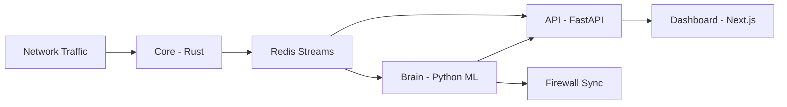

# Revenix - AI-Powered Network Security Platform

Intelligent threat detection and autonomous response for modern networks.

## Overview

Revenix is a network intrusion detection and prevention platform that combines deep packet inspection with a 5-model ML ensemble.

Core capabilities:
- Deep Packet Inspection (DPI)
  - JA3/JA3S TLS fingerprinting
  - DNS tunneling detection
  - SSH brute-force pattern detection
- 5-model ML ensemble
  - Isolation Forest
  - Autoencoder
  - Sequential Pattern Detector
  - Baseline Deviation Analyzer
  - Per-device Behavioral Profiling
- Self-healing response
  - Auto-block and manual block workflows
  - Temporary and permanent block lists
  - Cross-platform firewall synchronization
- Real-time dashboard
  - Live traffic and flow views
  - Threat management and IP management
  - Alerting configuration

## Architecture



Components:
- `core/` - packet capture, flow aggregation, DPI
- `brain/` - ML scoring, ensemble voting, self-healing decisions
- `api/` - persistence, auth, REST endpoints, notifications
- `dashboard/` - operator UI
- `deploy/sql/` - schema and seed scripts

## Quick Start

Prerequisites:
- Docker + Docker Compose
- 4 GB RAM minimum (8 GB recommended)
- For packet capture:
  - Linux Docker host for containerized core capture, or
  - Windows native agent bundle

### Linux Host (all-in-one with Docker core capture)

```bash
git clone https://github.com/so1icitx/revenix.git
cd revenix
docker compose up -d --build
```

Open:
- Dashboard: `http://localhost:3000`
- API docs: `http://localhost:8000/docs`

### Windows Host (control plane + native core agent)

```powershell
git clone https://github.com/so1icitx/revenix.git
cd revenix
python start-revenix.py
```

`start-revenix.py` starts the control plane and prepares/runs the Windows agent flow.

## Endpoint Agent Deployment

### Windows Endpoint Agent

1. Build bundle (from repo root):
```powershell
cd core
.\scripts\build-windows-agent.ps1
```
2. Copy `core\dist\windows-agent` to the endpoint.
3. Copy `agent.env.example` to `agent.env` and set:
- `API_URL`
- `REDIS_URL`
- `REDIS_PASSWORD`
- `INTERNAL_SERVICE_TOKEN`
4. Install as Administrator:
```powershell
Set-ExecutionPolicy -Scope Process Bypass -Force
.\install.cmd
```

Agent task controls (Admin shell):
```powershell
.\status.cmd
.\stop.cmd
.\start.cmd
.\restart.cmd
```

### Linux Endpoint Agent

1. Build bundle (from repo root):
```powershell
cd core
.\scripts\build-linux-agent.ps1
```
2. Copy `core/dist/linux-agent` to endpoint.
3. Configure `agent.env`.
4. Install:
```bash
sudo ./install.sh
```

## Authentication and Access

- First account is created via signup.
- API endpoints require authentication after initial setup.
- Internal service calls use `X-Internal-Token` (`INTERNAL_SERVICE_TOKEN`).

## Alerting Channels

Supported integration types:
- `slack`
- `discord`
- `email`
- `pagerduty`
- generic `webhook`

Configure in Dashboard -> Alerting.

## Learning and Training

- Initial training threshold default: `200` flows (configurable).
- Start learning from the dashboard/system controls.
- After threshold is reached, models train and system can run in active mode.

## Testing

Brain tests:
```bash
cd brain
pytest tests -v
```

Dashboard tests:
```bash
cd dashboard
npm install
npm test
```

## Security Notes

Before public/production deployment:
- Replace default secrets (`JWT_SECRET_KEY`, `INTERNAL_SERVICE_TOKEN`, `POSTGRES_PASSWORD`, `REDIS_PASSWORD`).
- Restrict network exposure and firewall access.
- Enable HTTPS via reverse proxy.
- Validate auto-block policy in monitor-first rollout.

## License

This project is licensed under GNU General Public License v3.0.
See `LICENSE`.
