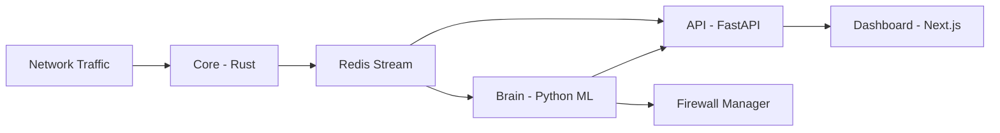

# Revenix

> AI-powered network detection and response with a Rust capture engine, Python ML brain, FastAPI API, and real-time dashboard.

## Architecture



> Design rule: keep packet capture and flow extraction deterministic in `core`; keep ML and policy decisions in `brain`.

## Components

| Component | Stack | Role |
| --- | --- | --- |
| `core` | Rust + libpcap | Packet capture, flow creation, protocol features |
| `brain` | Python | ML scoring, learning lifecycle, alert decisions |
| `api` | FastAPI + PostgreSQL | Persistence, endpoints, auth, WebSocket events |
| `dashboard` | Next.js | Live monitoring UI, alerts, controls |
| `redis` | Redis Streams | Low-latency transport between services |

## Quick Start (Main Server)

> Recommended: run the main stack on Linux for clean packet-capture behavior in production.

1. Start services:

```bash
docker compose up --build -d
```

2. Open:
- `http://localhost:3000` (dashboard)
- `http://localhost:8000/docs` (API docs)

3. Confirm containers:

```bash
docker compose ps
```

## Windows Endpoint Agent

Use the Windows agent for endpoint deployment or Windows-based testing.

1. Build bundle from `core`:

```powershell
cd core
.\scripts\build-windows-agent.ps1
```

2. Distribute the output folder:
- `core\dist\windows-agent`

3. Follow the install guide:
- `agents/windows/README.md`

> Keep `NETWORK_INTERFACE` empty unless you need to pin a specific interface. Bootstrap auto-selects a valid capture NIC.

## Notes on IP Visibility

> Endpoint capture sees traffic from that endpoint's perspective. For network-wide visibility (many hosts and full east-west traffic), deploy Linux sensor coverage at the network edge or a SPAN/mirror point.

## Docs

- `docs/index.md`
- `docs/windows-agent.md`
- `docs/troubleshooting.md`

## License

Apache-2.0 (see `LICENSE`).
